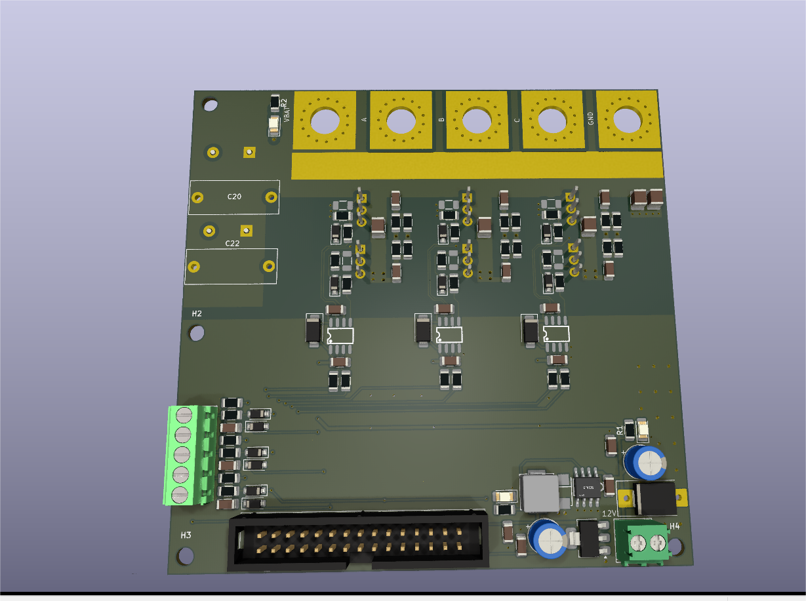
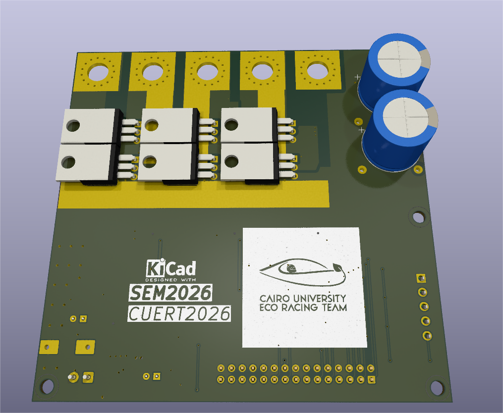

# OpenPowerModule

Kicad Design 
You can view on https://kicanvas.org (for non kicad users)

Minimal BLDC drive hardware (without microcontroller)

### The hardware 
* 3phase H-bridge and all its related circuitry (MGD , Snubber , decoupling , etc)
* Hall Sensor Conditioning Circuits
* IDC-2x15 Connector to be interfaced with a controller/MCU
* 12V-->5V buck converter , 3.3V LDO

### Repo Structure
* Main directory : design files
* Production directory : Gerbers and Bom
* LIB : Project Components library
* Doc : Design Reference , guide , step file , etc...
